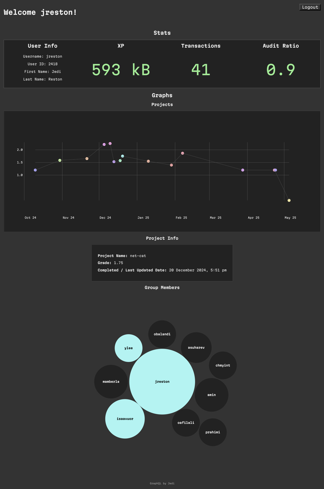

# graphql

## 📌 Objectives

The goal of this project is to learn and apply the **GraphQL query language** by creating a personal profile page using a GraphQL API provided by the platform.

- Authenticate using JWT tokens
- Query and display school data
- Visualize statistics using SVG graphs
- Host the project on GitHub Pages

## 🚀 Project Overview

This app connects to the GraphQL endpoint: `https://01.gritlab.ax/api/graphql-engine/v1/graphql`.

Once authenticated, it retrieves and displays the following:

### 🪪 **Stats Section**

- 🧑‍🎓 **User Info:** username, user ID, first name, and last name
- 📈 **Total XP amount**
- 🚀 **Transactions**
- 📊 **Audit ratio**

In addition, it includes:

### 📉 **Graphs Section**

- A **line graph** showing grades per project over time.
- A **circle/bubble chart** showing group members related to the selected project.

> 💡 Clicking a data point on the line graph reveals project details and group members dynamically.

These graphs are rendered using **SVG**, without third-party libraries, as required.

## 🔐 Authentication

The profile page is secured by a login mechanism. A **JWT token** is obtained from the following endpoint: `https://01.gritlab.ax/api/auth/signin`.

### Login

- Accepts both `username:password` and `email:password`
- Uses **Basic Auth** with credentials encoded in **Base64**
- On success, stores the JWT for authenticated GraphQL requests
- On failure, displays user-friendly error messages

### Logout

- Provides a clear method to log out and invalidate the session

### GraphQL Authentication

All queries to the GraphQL endpoint are made with **Bearer Token Authentication**. The JWT token restricts access to data belonging **only to the authenticated user**.

## 🧱 Technologies Used

- HTML, CSS, JavaScript
- GraphQL (queries + authentication)
- GraphiQL for easy schema exploration
- SVG for data visualization
- GitHub Pages for hosting

## 🌐 Hosting

This project is hosted on **GitHub Pages**. After pushing to the main branch, it becomes publicly viewable via: [https://jeeeeedi.github.io/graphql/](https://jeeeeedi.github.io/graphql/).

## 📸 Preview

## 🛠 Setup Instructions

1. Clone this repo
2. Open `index.html` in your browser or use a local server
3. Use your credentials to log in
4. Explore your profile and stats
